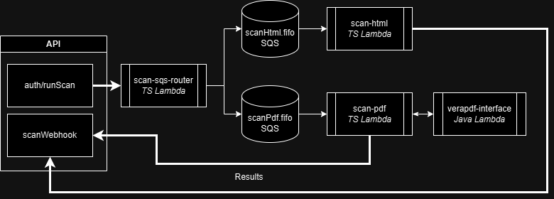

## Equalify Scan Services Overview
Equalify's scan service is built from an ensemble of microservices which live in this folder. 
### AWS Scans
---
When using AWS architecture, Equalify's scans operate as follows:
- Scans are initiated by passing an array of URLs to be scanned to `aws-lambda-scan-sqs-router`
- `aws-lambda-sqs-scan-router` breaks these requests into chunks and forwards them to the appropriate SQS queue for each scan type (HTML, PDF, etc)
- **HTML** URLs are scanned via `aws-lambda-scan-html` using a Chromium-based headless browser.
- **PDF** URLs are handled by `aws-lambda-scan-pdf`, which in turn passes the URL to the Java-based `aws-lambda-verapdf-interface` for downloading the PDF and executing the scan.
- Results are converted into [EqualifyV2 format](../shared/convertors/) and returned by calling the [API results webhook](../apps/backend/routes/public/scanWebhook.ts)

| Service | Language | Function
| - | - | -
| `aws-lambda-scan-sqs-router` | Typescript | Accepts any number of URLs via JSON, and forwards each URL to the appropriate SQS queue (`scan-html` or `scan-pdf`). [JSON Input typing can be found here](../shared/types/scansSchema.zod.ts)
| `aws-lambda-scan-html` | Typescript | Accepts URL from SQS and performs Chromium-based accessibility scan. Sends results in EqualifyV2 format to [API results webhook](../apps/backend/routes/public/scanWebhook.ts).
| `aws-lambda-scan-pdf` | Typescript | Accepts URL from SQS and forwards to PDF scanner. Formats results in EqualifyV2 format and sends results to [API results webhook](../apps/backend/routes/public/scanWebhook.ts).
| `aws-lambda-verapdf-interface` | Java | Native Java lambda to scan PDFs. Accepts PDF URL, downloads PDF, performs scan, and returns result in raw veraPDF JSON format. 

